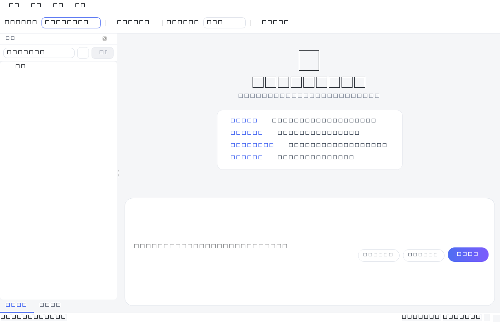
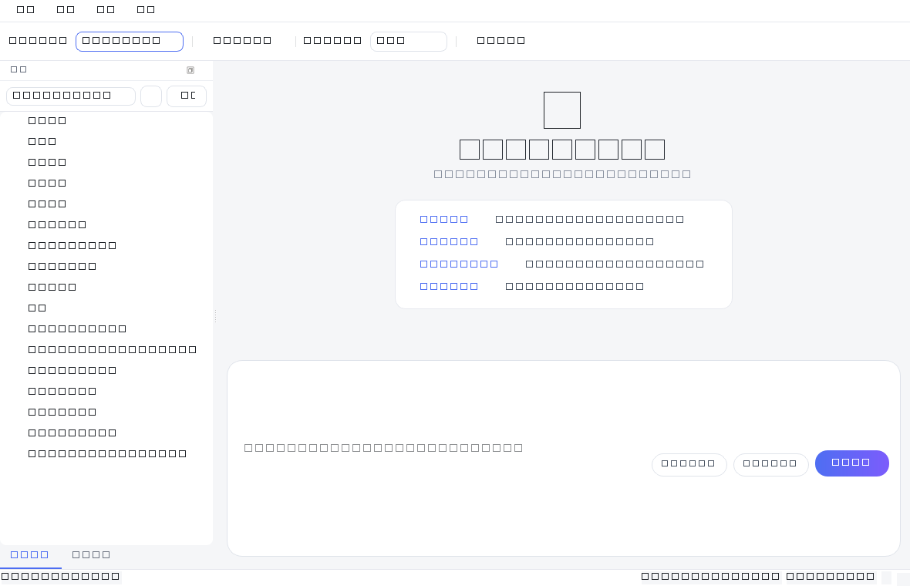
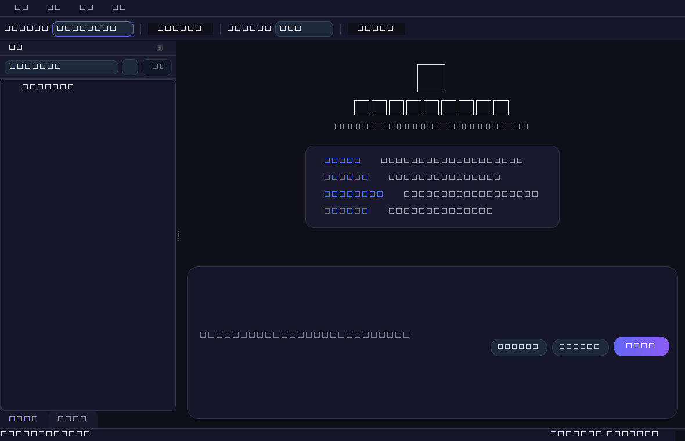

# CodeAgent - 只管代码的 AI Agent

[](https://github.com/wangzishi765/AI-Agent-/actions/workflows/build.yml)
[](https://github.com/wangzishi765/AI-Agent-/releases)
[](LICENSE)

> 一个专注于代码全生命周期的 Windows 桌面 AI 助手：写代码、改代码、调试、解释、审查、修 Bug。
> 界面为 DeepSeek / 豆包 风格的现代聊天应用（默认浅色，可切换深色主题），支持系统托盘常驻。

## 🖼️ 界面预览

**浅色主题（默认）**





**深色主题**（设置 → 主题 一键切换）



## ✨ 特性

### 🤖 AI 模型
- **DeepSeek API** - 云端大模型，填入 API Key 即用
- **vLLM 本地模型** - OpenAI 兼容接口，完全本地可控
- 工具栏一键切换，设置保存后即时生效

### 💻 核心能力
- **能读** - 读取本地项目文件，理解代码上下文
- **能写** - 自动生成、修改代码文件（改前/改后 Diff 预览气泡）
- **能跑** - Docker 容器隔离执行代码（可关闭，退回本地命令）
- **能解释 / 能审查 / 能重构** - 代码解释、架构分析、质量审查、Bug 定位

### 🎨 界面（DeepSeek / 豆包 风格）
- 浅色 / 科技深色 / 纯黑 三套主题，运行中即时切换
- 聊天内容限宽居中；用户消息右侧蓝色气泡、助手左侧白色气泡带头像
- 底部圆角输入卡片：宽度随窗口伸缩、高度随输入行数自适应
- 内置终端、代码编辑器（语法高亮 + AI 自动补全、Tab 接受）
- 改文件后 Diff 对比、代码块一键运行
- 多语言界面（中 / 英 / 日 / 韩）

### 🔧 工程工具
- **Git 集成** - 状态、日志、一键提交（侧栏 Git 按钮）
- **代码格式化 / Linter** - black、isort、prettier、eslint、gofmt 等（自动识别 Windows `.cmd` 垫片）
- **文件与代码搜索** - 文件名（Ctrl+P）、全局内容搜索（Ctrl+Shift+F），后台执行不卡界面
- **代码片段管理** - 分类、搜索、一键插入
- **拖拽 / 附件** - 文件拖入即作为上下文
- **截图 OCR** - 输入框 Ctrl+V 粘贴图片自动转文字（需 Tesseract）
- **语音输入** - 按住说话转文字（需 PyAudio + SpeechRecognition）
- **对话导出** - Markdown / JSON / PDF

### ⚙️ 系统
- 权限模式可配置（严格 / 半自动 / 全自动）
- **系统托盘常驻**：关闭窗口收进托盘，单击 / 双击托盘图标恢复，右键菜单显示窗口 / 退出
- 全局召唤热键（Ctrl+Alt+C，需 `keyboard` 库）
- SQLite 本地存储，对话历史可搜索、置顶、重命名
- 自动更新检测（发现新版本可一键下载安装）
- 开发者工具面板（操作日志、错误堆栈、日志导出）

## ⬇️ 下载安装

不想配置环境？直接到 **[Releases](https://github.com/wangzishi765/AI-Agent-/releases/latest)** 下载
`CodeAgent-Setup-v1.0.0.exe`，双击安装即可（向导含中文/English/日本語/한국어，自带卸载程序）。

## 🚀 快速开始

### 环境要求
- Windows 10/11，Python 3.10+（开发环境为 Python 3.14）
- Docker Desktop（可选，用于代码隔离运行）
- Tesseract（可选，用于 OCR）；PyAudio（可选，用于语音）

### 安装依赖
```bash
pip install -r requirements.txt
```

### 运行
```bash
python main.py
```

### 首次配置
1. 打开「设置（Ctrl+,）→ AI 模型」
2. 填入 DeepSeek API Key（https://platform.deepseek.com 申请）
3. 保存即可开始对话；如需本地模型，填好 `http://localhost:8000/v1` 后在工具栏切到「vLLM 本地」

## 📦 打包为独立 App 与安装包

```bash
# 1) 打包单文件 exe（免命令行，双击即用）
python -m PyInstaller --noconfirm --clean --windowed --onefile --name CodeAgent ^
  --icon "resources\icons\app.ico" --add-data "resources;resources" ^
  --hidden-import openai --hidden-import docker --hidden-import git ^
  --hidden-import whoosh --hidden-import pathspec --hidden-import pytesseract ^
  --hidden-import speech_recognition --hidden-import keyboard --hidden-import psutil ^
  --hidden-import dotenv --hidden-import markdown --hidden-import pygments ^
  --hidden-import aiosqlite main.py
# 产物：dist\CodeAgent.exe

# 2) 生成正式安装包（含卸载程序，需安装 Inno Setup 6）
& "C:\Program Files (x86)\Inno Setup 6\ISCC.exe" "scripts\build_installer.iss"
# 产物：dist\CodeAgent-Setup-v1.0.0.exe
```

也可直接运行一键脚本（自动下载/安装 Inno Setup 并编译）：
```powershell
powershell -ExecutionPolicy Bypass -File ".\scripts\make_installer.ps1"
```

## 📁 项目结构

```
CodeAgent/
├── main.py                    # 入口
├── requirements.txt
├── app/                       # 应用基础层（配置、数据库、主题、更新、i18n）
├── core/                      # 核心业务层（Agent、执行器、文件/Git/格式化/搜索/OCR/语音）
├── models/                    # 模型层（DeepSeek、vLLM、代码补全）
├── ui/                        # 界面层（主窗口、聊天、侧栏、编辑器、设置、终端等）
├── resources/                 # 主题 QSS、应用图标
├── scripts/                   # 打包脚本与 Inno Setup 配置
└── tests/                     # 测试
```

## 🎯 使用场景

- **代码生成** - “帮我写一个 Python 快速排序”
- **代码修改** - “把这个函数改成异步的”
- **Bug 修复** - “这个报错怎么修？（粘贴错误信息）”
- **代码审查** - “审查一下这个文件的代码质量”
- **项目分析** - “读取当前项目，分析代码结构”
- **Git 操作** - “把今天的改动提交一下”

## 🔮 后续规划

- [ ] 对话标签 / 分组 / 收藏
- [ ] 代码分析（复杂度 / 依赖图 / 调用链可视化）
- [ ] 第三方集成（Jira / 飞书 / 钉钉）
- [ ] 云端同步与多端协作
- [ ] 封装为 Skill / 插件

## 📄 许可证

[MIT License](LICENSE)
